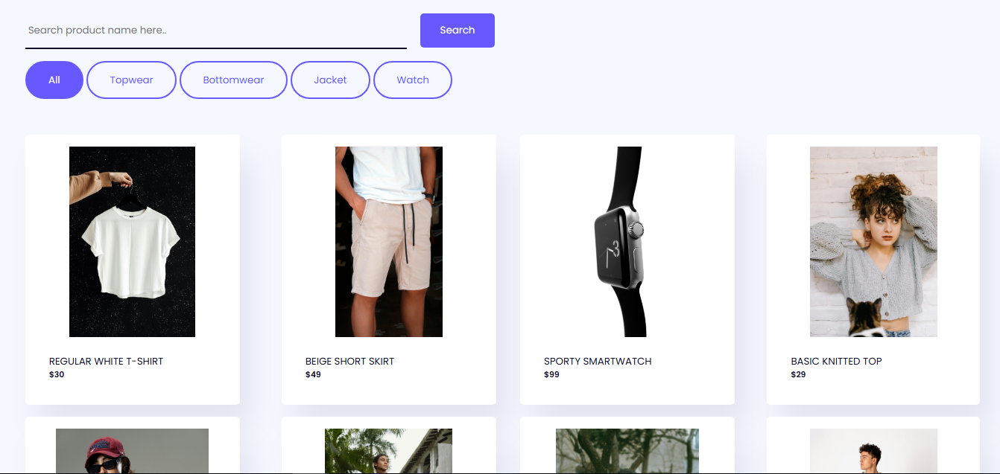
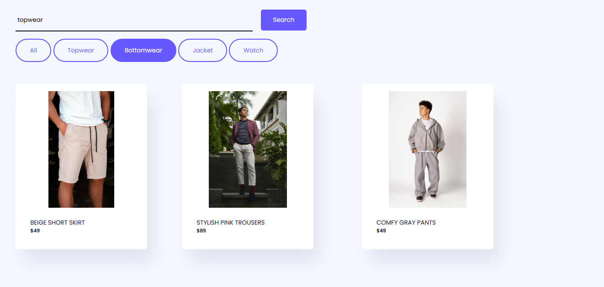
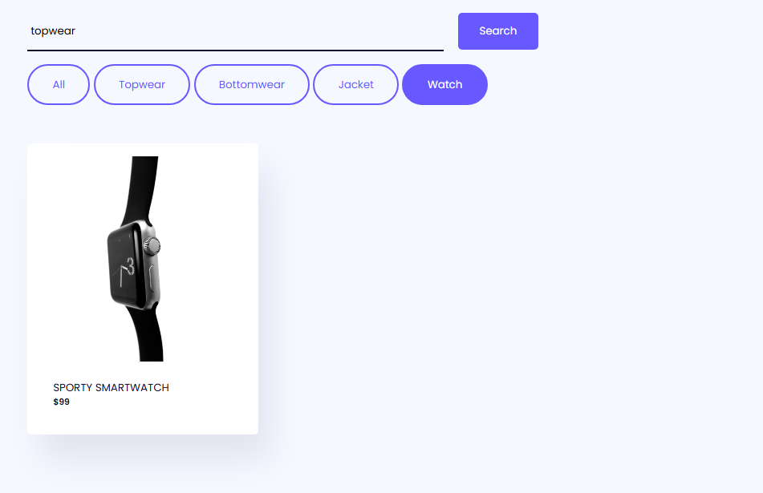
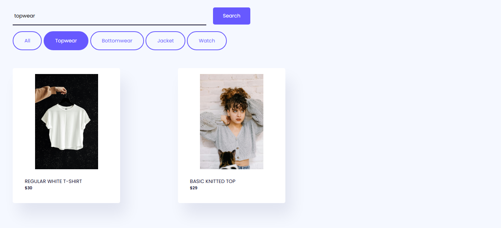
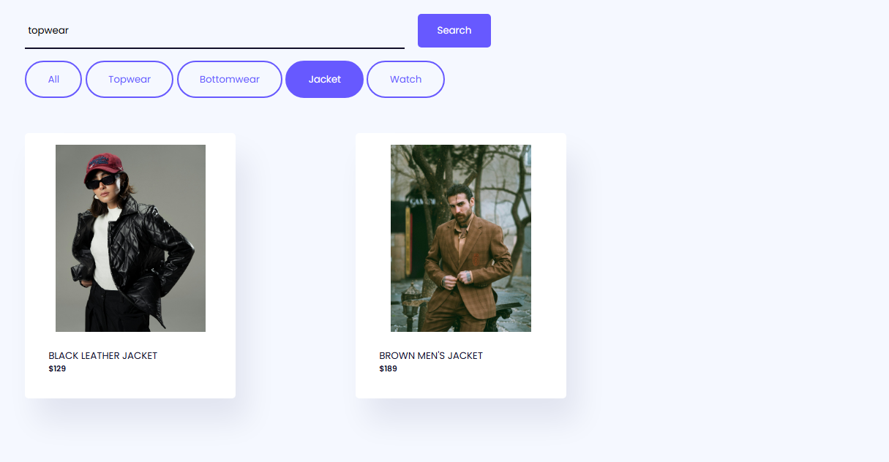

# Category-based Search Filter

## Description

This is a simple search filter project built with HTML, CSS, and JavaScript.
It allows users to filter items based on categories.
All data (images, names, and other details) are integrated directly into the code — no API or server required.

## Features

-   Category-based search filter

-   Responsive design

-   Pure front-end project

## Technologies used
- HTML

-  CSS

-  JavaScript

## How to use

    Download or clone this repository.

    Open the index.html file in your browser.

    Start typing a category in the search bar to filter the items.

## Screenshot

## Author

Nyabeng Mineme
